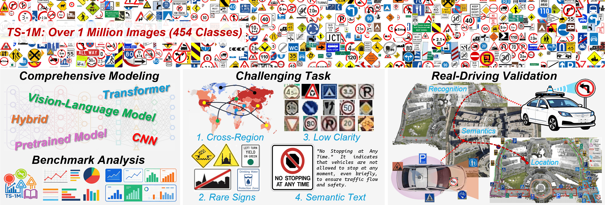
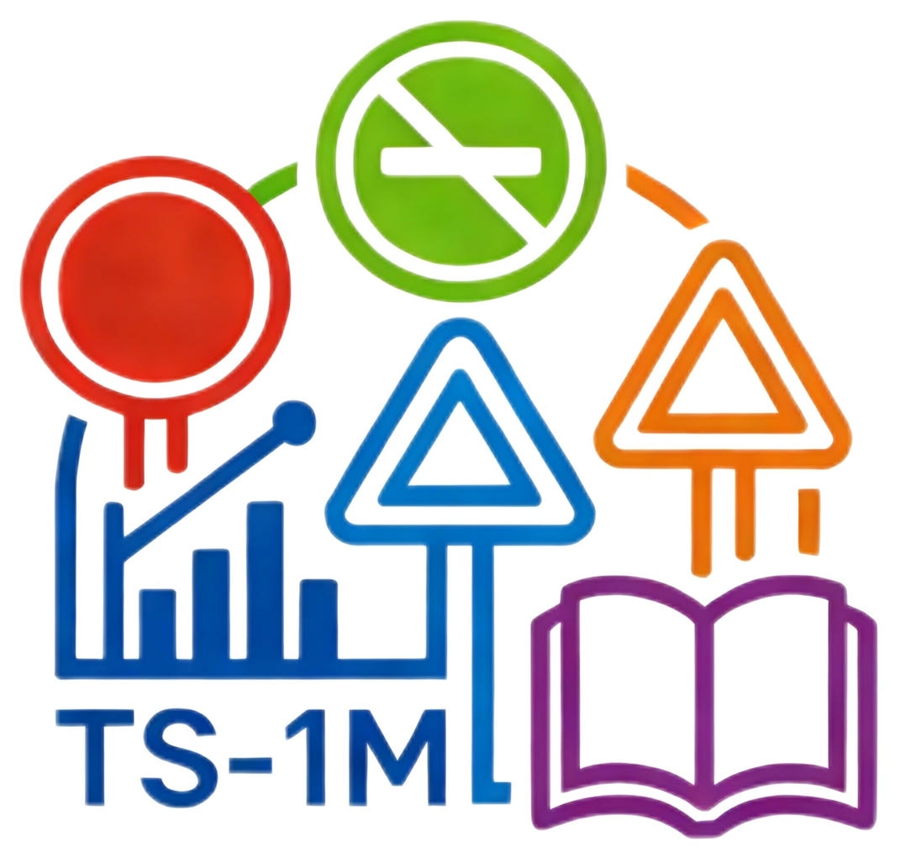
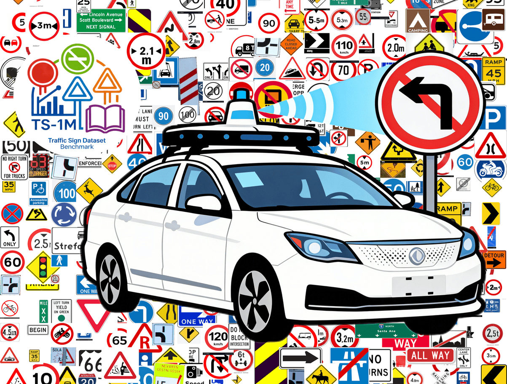
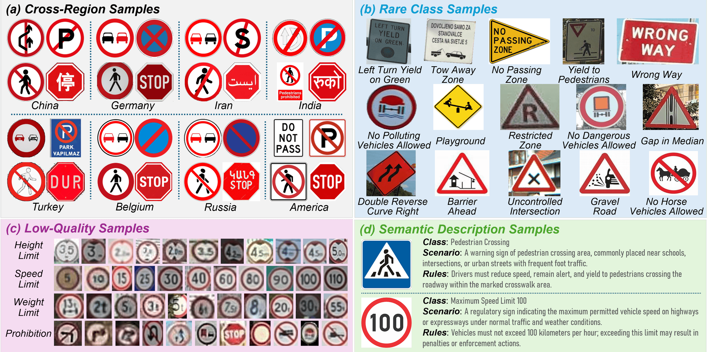

[](https://github.com/sindresorhus/awesome)
[](https://arxiv.org/)

[](https://github.com/guoyangzhao/Traffic-Sign-Recognition/pulls)

# :sunglasses: Traffic Sign Recognition in Autonomous Driving: Dataset, Benchmark, and Field Testing

|  |
|:-:|

This project presents **TS-1M**, a large-scale dataset and diagnostic benchmark for traffic sign understanding.

TS-1M contains over **1M images across 454 categories** with unified annotations and diverse real-world conditions. 
It is designed to evaluate model robustness under **cross-region shifts**, **long-tail distributions**, and **low-clarity scenarios**, while exploring the role of **semantic-enhanced learning**. 
We further validate its practical value by integrating TS-1M into a real autonomous driving system for perception and semantic reasoning.
We organize TS-1M around four key aspects:

| | |
|:-:|:-|
|  | **Unified Large-Scale Dataset**. 1M+ images with standardized annotations across 454 categories, providing a consistent foundation for traffic sign recognition. |
|  | **Benchmark Across Model Paradigms**. Systematic evaluation of CNNs, transformers, self-supervised, and vision-language models under a unified protocol. |
|  | **Challenge-Oriented Evaluation**. Dedicated subsets for cross-region, rare-class, and low-clarity scenarios enable detailed robustness analysis. |
|  | **Real-World Validation**. Integration with VLM-based reasoning and 3D mapping demonstrates end-to-end perception-to-decision capability. |
| | |

For more details, kindly refer to our [paper](https://XXX) and [project page](https://guoyangzhao.github.io/projects/ts1m/). :rocket:


### :books: Citation 

If you find this work helpful for your research, please kindly consider citing our papers:
```bib
XXX
```
```bibtex
@inproceedings{zhao2025tsclip,
  title={TSCLIP: Robust CLIP fine-tuning for worldwide cross-regional traffic sign recognition},
  author={Zhao, Guoyang and Ma, Fulong and Qi, Weiqing and Zhang, Chenguang and Liu, Yuxuan and Liu, Ming and Ma, Jun},
  booktitle={2025 IEEE International Conference on Robotics and Automation (ICRA)},
  pages={3846--3852},
  year={2025},
  organization={IEEE}
}
```


### Table of Contents
- [**0. Background**](#background)
  - [Key Challenges](#key-challenges)
  - [Motivation](#motivation)
- [**1. Datasets**](#1-datasets)
  - [TS-1M Datasets](#one-ts-1m-datasets)
  - [Datasets Comparison](#two-datasets-comparison)
- [**2. Modeling**](#2-modeling)
  - [Classic Supervised Models](#one-classic-supervised-models)
  - [Self-Supervised Pretrained Models](#two-self-supervised-pretrained-models)
  - [Vision-Language Models](#three-vision-language-models)
- [**3. Research of Traffic Sign Recognition**](#3-research-of-traffic-sign-recognition)
- [**4. Research of Challenge Task**](#4-research-of-challenge-task)
  - [Cross-Region Recognition](#one-cross-region-recognition)
  - [Rare-Class Recognition](#two-rare-class-recognition)
  - [Low-Clarity Recognition](#three-low-clarity-recognition)
  - [Semantic Understanding](#four-semantic-understanding)
- [**5. Benchmark Results & Analysis**](#5-benchmark-results--analysis)
  - [Main Results](#one-main-results)
  - [Real-World Applications](#two-real-world-applications)
  - [Effect on Autonomous Driving](#three-effect-on-autonomous-driving)
- [**6. Acknowledgements**](#6-acknowledgements)


# Background

| | |
|:-:|:-|
|  | Traffic sign recognition plays a critical role in autonomous driving by providing essential cues for navigation and safety. Despite strong performance on standard benchmarks, existing models often struggle to generalize in real-world environments due to distribution shifts and visual variability. |
| | |


## Key Challenges

Real-world TSR remains challenging due to several factors:

- **Regional variation**: sign appearance and standards differ across countries  
- **Long-tail distribution**: many categories have limited samples  
- **Low-clarity conditions**: blur, distance, and occlusion degrade visual quality  
- **Semantic ambiguity**: similar appearances may imply different meanings  

These challenges highlight the gap between benchmark performance and real-world deployment.


## Motivation

Current datasets and evaluations often fail to capture these complexities, making it difficult to assess model robustness in realistic settings.  
A systematic benchmark is therefore needed to evaluate how models behave under distribution shifts, data imbalance, and degraded visual conditions.

|  |
|:-:|


# 1. Datasets

### :one: TS-1M Datasets

> :timer_clock: In chronological order, from the earliest to the latest.


### :two: Datasets Comparison

> :timer_clock: In chronological order, from the earliest to the latest.

| Model | Paper | Venue | Website | 
|:-:|:-|:-:|:-:|
||
| `KITTI` | Are We Ready for Autonomous Driving? The KITTI Vision Benchmark Suite | CVPR 2012 | [](https://www.cvlibs.net/datasets/kitti/) |
| `NYUv2` | Indoor Segmentation and Support Inference from RGBD Images | ECCV 2012 | [](https://cs.nyu.edu/~fergus/datasets/nyu_depth_v2.html) |
| `CARLA` | [](https://arxiv.org/abs/1711.03938)<br>CARLA: An Open Urban Driving Simulator | CoRL 2017 | [](https://carla.org/) |
| `SemanticKITTI` | [](https://arxiv.org/abs/1904.01416)<br>SemanticKITTI: A Dataset for Semantic Scene Understanding of LiDAR Sequences | ICCV 2019 | [](https://semantic-kitti.org/) |
| `nuScenes` | [](https://arxiv.org/abs/1903.11027)<br>nuScenes: A Multimodal Dataset for Autonomous Driving | CVPR 2020 | [](https://www.nuscenes.org/) |


# 2. Modeling

### :one: Classic Supervised Models

> :timer_clock: In chronological order, from the earliest to the latest.

| Model | Paper | Venue | Website | GitHub | 
|:-:|:-|:-:|:-:|:-:|
||
| ResNet-50 / ResNet-101   | [](https://arxiv.org/abs/1512.03385) Deep Residual Learning for Image Recognition | CVPR 2016       | -                                                                       | [](https://github.com/KaimingHe/deep-residual-networks)|
| ResNeXt-50               | [](https://arxiv.org/abs/1611.05431) Aggregated Residual Transformations for Deep Neural Networks | CVPR 2017       | -                                                                       | [](https://github.com/facebookresearch/ResNeXt) |
| ShuffleNetV2             | [](https://arxiv.org/abs/1807.11164) ShuffleNet V2: Practical Guidelines for Efficient CNN Architecture Design | ECCV 2018       | -                                                                       | [](https://github.com/megvii-model/ShuffleNet-Series) |
| MobileNetV3              | [](https://arxiv.org/abs/1905.02244) Searching for MobileNetV3 | ICCV 2019       | -                                                                       | [](https://github.com/pytorch/vision/blob/main/torchvision/models/mobilenetv3.py) |
| EfficientNetV2           | [](https://arxiv.org/abs/2104.00298) EfficientNetV2: Smaller Models and Faster Training | ICML 2021       | [](https://github.com/google/automl/tree/master/efficientnetv2) | [](https://github.com/google/automl) |
| ConvNeXt                 | [](https://arxiv.org/abs/2201.03545) A ConvNet for the 2020s | CVPR 2022       | -                                                                       | [](https://github.com/facebookresearch/ConvNeXt) |
| Vision Transformer (ViT) | [](https://arxiv.org/abs/2010.11929) An Image is Worth 16x16 Words: Transformers for Image Recognition at Scale | ICLR 2021       | [](https://github.com/google-research/vision_transformer) | [](https://github.com/google-research/vision_transformer) |
| MobileViT                | [](https://arxiv.org/abs/2110.02178) MobileViT: Light-weight, General-purpose, and Mobile-friendly Vision Transformer | ICLR 2022       | -                                                                       | [](https://github.com/apple/ml-cvnets) |
| EdgeNeXt                 | [](https://arxiv.org/abs/2206.10589) EdgeNeXt: Efficiently Amalgamated CNN-Transformer Architecture for Edge Devices | ECCV W 2022     | -                                                                       | [](https://github.com/mmaaz60/EdgeNeXt) |
| SimCLR            | [](https://arxiv.org/abs/2002.05709) A Simple Framework for Contrastive Learning of Visual Representations | ICML 2020       | -                                                                       | [](https://github.com/google-research/simclr) |
| MoCo v3           | [](https://arxiv.org/abs/2104.02057) An Empirical Study of Training Self-Supervised Vision Transformers | ICCV 2021       | -                                                                       | [](https://github.com/facebookresearch/moco-v3) |
| DINO             | [](https://arxiv.org/abs/2104.14294) Emerging Properties in Self-Supervised Vision Transformers | ICCV 2021       | -                                                                       | [](https://github.com/facebookresearch/dino) |
| MAE              | [](https://arxiv.org/abs/2111.06377) Masked Autoencoders Are Scalable Vision Learners | CVPR 2022       | -                                                                       | [](https://github.com/facebookresearch/mae) |
| SimMIM         | [](https://arxiv.org/abs/2111.09886) SimMIM: A Simple Framework for Masked Image Modeling | CVPR 2022       | -                                                                       | [](https://github.com/microsoft/SimMIM) |
| CLIP      | [](https://arxiv.org/abs/2103.00020) Learning Transferable Visual Models From Natural Language Supervision | ICML 2021       | -                                                                       | [](https://github.com/openai/CLIP) |
| BLIP      | [](https://arxiv.org/abs/2201.12086) BLIP: Bootstrapping Language-Image Pre-training for Unified Vision-Language Understanding and Generation | ICML 2022       | -                                                                       | [](https://github.com/salesforce/LAVIS) |
| BLIP-2    | [](https://arxiv.org/abs/2301.12597) BLIP-2: Bootstrapping Language-Image Pre-training with Frozen Image Encoders and Large Language Models | ICLR 2023       | -                                                                       | [](https://github.com/salesforce/LAVIS) |
| LLaVA     | [](https://arxiv.org/abs/2304.08485) Visual Instruction Tuning | NeurIPS 2023    | [](https://llava-vl.github.io/) | [](https://github.com/haotian-liu/LLaVA) |
||


### :two: Self-Supervised Pretrained Models

> :timer_clock: In chronological order, from the earliest to the latest.

| Model | Paper | Venue | Website | GitHub | 
|:-:|:-|:-:|:-:|:-:|
||
| `GAIA-1` | [](https://arxiv.org/abs/2309.17080)<br>GAIA-1: A Generative World Model for Autonomous Driving | arXiv 2023 | [](https://wayve.ai/thinking/scaling-gaia-1/) | - |
| `ADriver-I` | [](https://arxiv.org/abs/2311.13549)<br>ADriver-I: A General World Model for Autonomous Driving | arXiv 2023 | - | - |
| `Drive-WM` | [](https://arxiv.org/abs/2311.17918)<br>Driving into the Future: Multiview Visual Forecasting and Planning with World Model for Autonomous Driving | CVPR 2024 | [](https://drive-wm.github.io/) | [](https://github.com/BraveGroup/Drive-WM) |
||


## :three: Vision-Language Models

> :timer_clock: In chronological order, from the earliest to the latest.

| Model | Paper | Venue | Website | GitHub | 
|:-:|:-|:-:|:-:|:-:|
||
| `MagicDrive3D` | [](https://arxiv.org/abs/2405.14475)<br>MagicDrive3D: Controllable 3D Generation for Any-View Rendering in Street Scenes | arXiv 2024 | [](https://gaoruiyuan.com/magicdrive3d/) | [](https://github.com/flymin/MagicDrive3D) |
| `DreamForge` | [](https://arxiv.org/abs/2409.04003)<br>DreamForge: Motion-Aware Autoregressive Video Generation for Multi-View Driving Scenes | arXiv 2024 | [](https://pjlab-adg.github.io/DriveArena/dreamforge/) | [](https://github.com/PJLab-ADG/DriveArena) |
||


# 3. Research of Traffic Sign Recognition

> :timer_clock: In chronological order, from the earliest to the latest.

| Model | Paper | Venue | Website | GitHub | 
|:-:|:-|:-:|:-:|:-:|
||
| `SSD` | [](https://arxiv.org/abs/2301.00527)<br>Diffusion Probabilistic Models for Scene-Scale 3D Categorical Data | arXiv 2023 | - | [](https://github.com/zoomin-lee/scene-scale-diffusion) |
| `SemCity` | [](https://arxiv.org/abs/2403.07773)<br>SemCity: Semantic Scene Generation with Triplane Diffusion | CVPR 2024 | [](https://sglab.kaist.ac.kr/SemCity/) |[](https://github.com/zoomin-lee/SemCity) |
| `WoVoGen` | [](https://arxiv.org/abs/2312.02934)<br>WoVoGen: World Volume-Aware Diffusion for Controllable Multi-Camera Driving Scene Generation | ECCV 2024 | - | [](https://github.com/fudan-zvg/WoVoGen) |
||


# 4. Research of Challenge Task

### :one: Cross-Region Recognition

> :timer_clock: In chronological order, from the earliest to the latest.

| Model | Paper | Venue | Website | GitHub | 
|:-:|:-|:-:|:-:|:-:|
||
| `SSD` | [](https://arxiv.org/abs/2301.00527)<br>Diffusion Probabilistic Models for Scene-Scale 3D Categorical Data | arXiv 2023 | - | [](https://github.com/zoomin-lee/scene-scale-diffusion) |
| `WoVoGen` | [](https://arxiv.org/abs/2312.02934)<br>WoVoGen: World Volume-Aware Diffusion for Controllable Multi-Camera Driving Scene Generation | ECCV 2024 | - | [](https://github.com/fudan-zvg/WoVoGen) |
||


### :two: Rare-Class Recognition

> :timer_clock: In chronological order, from the earliest to the latest.

| Model | Paper | Venue | Website | GitHub | 
|:-:|:-|:-:|:-:|:-:|
||
| `Emergent-Occ` | [](https://arxiv.org/abs/2210.01917)<br>Differentiable Raycasting for Self-supervised Occupancy Forecasting | ECCV 2022 | - | [](https://github.com/tarashakhurana/emergent-occ-forecasting) |
||


### :three: Low-Clarity Recognition

> :timer_clock: In chronological order, from the earliest to the latest.

| Model | Paper | Venue | Website | GitHub | 
|:-:|:-|:-:|:-:|:-:|
||
| `Emergent-Occ` | [](https://arxiv.org/abs/2210.01917)<br>Differentiable Raycasting for Self-supervised Occupancy Forecasting | ECCV 2022 | - | [](https://github.com/tarashakhurana/emergent-occ-forecasting) |
||


### :four: Semantic Understanding

> :timer_clock: In chronological order, from the earliest to the latest.

| Model | Paper | Venue | Website | GitHub | 
|:-:|:-|:-:|:-:|:-:|
||
| `Emergent-Occ` | [](https://arxiv.org/abs/2210.01917)<br>Differentiable Raycasting for Self-supervised Occupancy Forecasting | ECCV 2022 | - | [](https://github.com/tarashakhurana/emergent-occ-forecasting) |
||


# 5. Benchmark Results & Analysis

### :one: Main Results

XXX

### :two: Real-World Applications

XXX


### :three: Effect on Autonomous Driving

XXX


# 6. Acknowledgements
